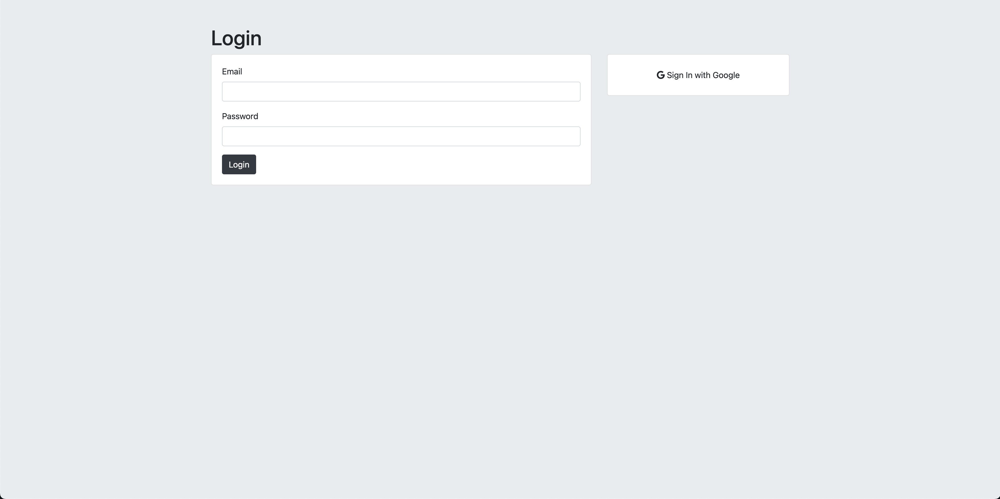

# Login and Secrets Manager


[](#)
> This app lets users register with a secure, hashed password or log in using Google. Once authenticated, users can submit and view their private secrets. Authentication ensures privacy and secure access.

## Overview

**Login and Secrets Manager** is a secure authentication system that allows users to create an account, log in with a password or Google authentication, and store private secrets. The application ensures that user data is securely stored and protected.

## Preview

<p align="center">
  
</p>

## Features

- **Secure Registration & Login:** Users can sign up with an email and password or log in using Google authentication.
- **Hashed Passwords:** All user passwords are hashed before storage to enhance security.
- **Private Secrets Storage:** Users can store their private secrets securely.
- **Database Management:** Uses MySQL to manage and store user credentials and secrets.

## Live Demo

**Explore the live version here:** [View Live Demo](https://marius-bogdan.com/projects/login-secrets-manager/)

## Local Setup

1. **Clone** the repository:
   ```bash
   git clone https://github.com/MIBogdan/login-secrets-manager.git
   ```
2. **Import the database:** 
- Import the `secrets` file into MySQL. This will automatically create the `secrets` database and populate it with the necessary data.


3. **Ensure your MySQL credentials match the following** (as used in `index.js`):
- **Username**: `root`
- **Host**: `localhost`
- **Database**: `secrets`
- **Password**: (leave empty if not set)


4. **Install** dependencies:
   ```bash
   npm install
   ```

5. **Run** the application:
   ```bash
   npm start
   ```
- The development server will open automatically in your default browser.
- **If it doesn't open automatically**,manually visit: http://localhost:3000 in your browser.

6. **Terminate** the server:
- **On macOS/Linux:** Press `Control + C` in the terminal. 
- **On Windows:** Press `Ctrl + C` in the Command Prompt or PowerShell. 
---

## Author

**Marius Bogdan**  
[Personal portfolio](https://marius-bogdan.com/)

Feel free to reach out for any questions or collaborations!

## License

This project is provided for testing and demonstration purposes only. All rights are reserved. No part of this project may be redistributed, reuploaded, or used in any manner (commercially or otherwise) without explicit written permission from the author.
